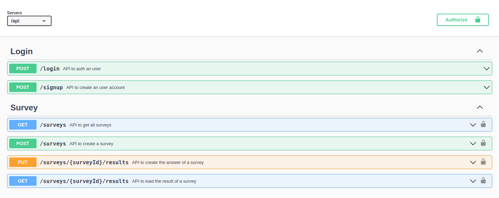

[](https://www.travis-ci.com/leonardopliski/clean-ts-api)
[](https://coveralls.io/github/leonardopliski/clean-ts-api)
[](http://standardjs.com)
[](https://opensource.org/)

### **Clean TS API**

This repository contains the API of the [Rodrigo Manguinho](https://www.udemy.com/user/rodrigo-manguinho/) - [NodeJs, Typescript, TDD, DDD, Clean Architecture and SOLID](https://www.udemy.com/course/tdd-com-mango/) training on udemy.

The goal of this API is to create a well defined and decoupled architecture, using TDD (Test Driven Development) as a working methodology. It also uses the Clean Architecture to distribute the responsibilities between layers, always following the principles of SOLID and applying Design Patterns to solve common problems.

## [**Link to the OpenAPI Docs**](https://lpliski.herokuapp.com/api-docs)

<p align="center">
  
</p>

> ## APIs

1. [Sign Up](./__requirements__/signup.md)
2. [Login](./__requirements__/login.md)
3. [Create Survey](./__requirements__/add-survey.md)
4. [Load Surveys](./__requirements__/load-surveys.md)
5. [Reply Survey](./__requirements__/save-survey-result.md)
6. [Survey Result](./__requirements__/load-survey-result.md)


## Local Installation

First of all, clone this `repo`:

```sh
git clone git@github.com:leonardopliski/clean-ts-api.git
```

Move to the project dir:

```sh
cd clean-ts-api/
```
Review the `.env.local` settings to bootstrap your environment.

With [NVM](https://github.com/nvm-sh/nvm) run:

```sh
nvm use
```

With [NPM](https://www.npmjs.com/) run:

```sh
npm install
```

With [Docker Compose](https://docs.docker.com/compose/) just run:

```sh
npm run up
```

Done! Access your endpoints:

API Docs:

```
http://localhost:5050/api-docs/
```

MongoDB Express Interface:
```
http://localhost:8081/
```

> ## Applied Principles

* SRP - Single Responsibility Principle
* OCP - Open Closed Principle
* LSP - Liskov Substitution Principle
* ISP - Interface Segregation Principle
* DIP - Dependency Inversion Principle
* SOC - Separation of Concerns
* DRY - Don't Repeat Yourself
* YAGNI - You Aren't Gonna Need It
* KISS - Keep It Simple, Silly
* Composition Over Inheritance
* Small Commits

> ## Applied Design Patterns

* Factory
* Adapter
* Composite
* Decorator
* Proxy
* Dependency Injection
* Abstract Server
* Composition Root
* Builder
* Singleton

> ## Methodologies and Design Decisions

* DDD
* TDD
* Clean Architecture
* Conventional Commits
* Modular Design
* Dependency Diagrams
* Use Cases
* CI - Continuous Integration
* CD - Continuous Deployment

> ## Technologies

* NPM
* Typescript
* Git
* Docker
* Jest
* MongoDb
* Travis CI
* Swagger
* Bcrypt
* JsonWebToken
* Faker
* Coveralls
* Validator
* Express
* Apollo Server Express
* GraphQL
* GraphQL ISO Date
* GraphQL Scalars
* GraphQL Tools
* Supertest
* Husky
* Lint Staged
* Eslint
* Standard Javascript Style
* Sucrase
* Nodemon
* Rimraf
* In-Memory MongoDb Server
* MockDate
* Module-Alias
* Copyfiles
* Npm Check
* Bson ObjectId
* Apollo Server Integration Testing

> ## Node.js Features

* OpenAPI Docs with Swagger
* Rest API with Express
* GraphQL with Apollo Server
* Error Logging
* Security (Hashing, Encryption and Encoding)
* CORS
* Middlewares
* Per-Route access control (Admin, Normal User and Anonymous UserAnonymous User)
* Heroku deployment 
* Static File Serving (Just for demonstration purposes, it's recommended to segregate it in production API's).

> ## GraphQL Features 

* Types
* Queries
* Mutations
* Resolvers
* Directives
* Scalars
* Plugins

> ## Git Features

* Aliases
* Branch
* Reset
* Amend
* Tag
* Stash
* Rebase
* Merge

> ## Typescript Features 

* Advanced OOP
* Interfaces
* TypeAliases
* Namespaces
* Utility Types
* Path Modularization
* Config preparation
* Build
* Deploy
* Breakpoints usage with VSCode

> ## Tests

* Unit tests
* Integration tests (For the Rest API & GraphQL)
* Tests coverage
* Test Doubles
* Mocks
* Stubs
* Spies
* Fakes

> ## MongoDB Features 

* Connect and Reconnect
* Collections
* InsertOne and InserMany
* Find, FindOne and FindOneAndUpdate
* DeleteMany
* UpdateOne
* Aggregation (Match, Group, Unwind, Lookup, AddFields, Project, Sort)
* ObjectId
* Upsert and ReturnOriginal
* Push, Divide, Multiply, ArrayElemAt, Cond, Sum
* Filter, Map, Reduce, MergeObjects, ConcatArrays
